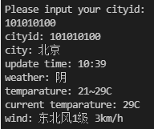

# 树莓派PICO：使用rt-thread micropython软件包联网获取天气

### 项目描述

本项目使用树莓派PICO开发板和ESP8266作为硬件，使用[RT-Thread MicroPython - Visual Studio Marketplace](https://marketplace.visualstudio.com/items?itemName=RT-Thread.rt-thread-micropython)进行python软件开发，通过http请求获取实时天气信息。

### 嵌入式软件配置

#### 使用RT-Thread Studio

* 安装RP2040-RASPBERRYPI-PICO的SDK

  

* 创建RT-Thread项目，选择基于开发板--->RP2040-RASPBERRYPI-PICO

* 打开所建项目中的RT-Thread Settings，并添加micropython和AT-Device软件包

* 配置micropython

  使能usocket和ujson库，并适当调大Heap size

  

* 配置AT_Device

* 使能乐鑫ESP8266，并使能示例，输入SSID与密码，将设备名称改为uart1

  

* 使能组件--->网络--->AT命令

* 使能组件--->设备驱动程序--->使用WiFi框架

* 将ESP8266连接到树莓派PICO的UART1上

* 编译下载程序

#### 使用ENV

* 克隆rt-thread代码

  ``` bash
  git clone https://github.com/RT-Thread/rt-thread.git
  ```

* 进入树莓派pico的bsp中

  ``` bash
  cd rt-thread/bsp/raspberry-pico
  ```

* 打开menuconfig，并对RT-Thread进行配置，请参考上节【使用RT-Thread Studio】

  ``` bash
  scons --menuconfig
  ```

* 对软件包进行更新

  ``` bash
  pkgs --update
  ```

* 执行编译

  ``` bash
  scons
  ```

### HTTP请求过程

* 创建socket(TCP数据流模式)，连接http服务器

* 发送HTTP请求

  HTTP请求由请求行（request line）、请求头部（headers）、空行（blank line）和请求数据（request body）4个部分组成。

  > 请求行
  >
  > > 由请求方法、请求地址URL、HTTP协议版本组成。
  > >
  > > > 请求方法：HTTP/1.1 定义的请求方法有8种：GET/POST/PUT/DELETE/PATCH/HEAD/OPTIONS/TRACE
  > > >
  > > > 请求地址URL：要请求的路径
  > > >
  > > > HTTP协议版本：HTTP/主版本号.次版本号，常用的有HTTP/1.0和HTTP/1.1
  > >
  > > 例如：`GET /user/login HTTP/1.1`
  >
  > 请求头部
  >
  > > 请求头部为请求报文添加了一些附加信息，每行一条，用":"隔开
  > >
  > > 常用请求头：
  > >
  > > | Host            | 服务器主机地址                   |
  > > | --------------- | -------------------------------- |
  > > | User-Agent      | 发送请求的应用程序名称           |
  > > | Connection      | 指定与连接相关的属性             |
  > > | Accept-Encoding | 通知服务器可以发送的数据压缩格式 |
  > >
  > > 例如：` Connection: keep-alive`
  >
  > 空行
  >
  > > 本行只包含`\r\n`
  >
  > 请求数据
  >
  > > 请求数据不在GET方法中使用，而在POST方法中使用。与请求数据相关的最长使用的请求头部是Cntent-Type和Content-Length。

* 接收Response

  Response由状态行（status line）、相应头部（headers）、空行（blank line）和响应数据（response body）4个部分组成。

* 关闭socket

### 

### 代码实现

创建RT-Thread MicroPython工程

创建request方法： `def request(uri, method, para=None):`

> 解析uri，解算出域名、端口、请求路径
>
> 使用usocket建立socket连接
>
> 发送请求头部
>
> 读取response
>
> 对response进行解析，并创建`HttpResponse`类并返回

调用`request()`获取天气信息。

API地址: [免费实时天气接口API 实况天气api (yiketianqi.com)](https://yiketianqi.com/index/doc?version=day)

``` python
uri = "https://tianqiapi.com/free/day?appid=&appsecret="
uri += "&cityid=" + cityid
resp = request(uri, "GET")
parsed = parseWeater(resp.body)
if("errmsg" in parsed):
    print(parsed["errmsg"])
    continue
    print("cityid: " + parsed["cityid"])
    print("city: " + parsed["city"])
    print("update time: " + parsed["update_time"])
    print("weather: " + parsed["wea"])
    print("temparature: " +
          parsed["tem_night"] + "~" + parsed["tem_day"] + "C")
    print("current temparature: " + parsed["tem_day"] + "C")
    print("wind: " + parsed["win"] +
          parsed["win_speed"] + " " + parsed["win_meter"])
    print()
```

### 运行示例

获取北京天气



